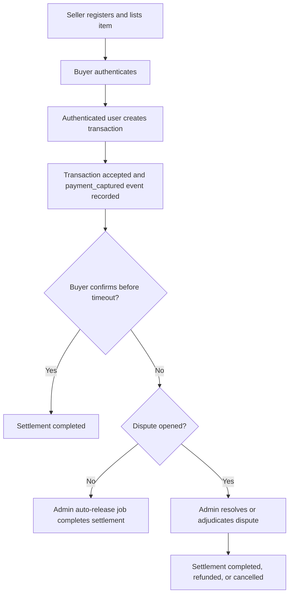
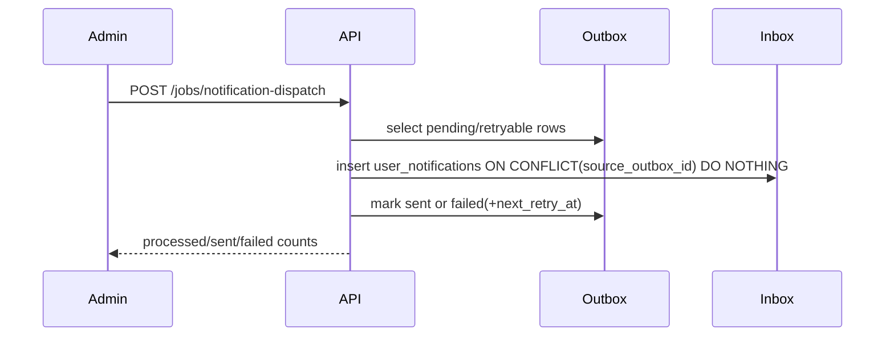
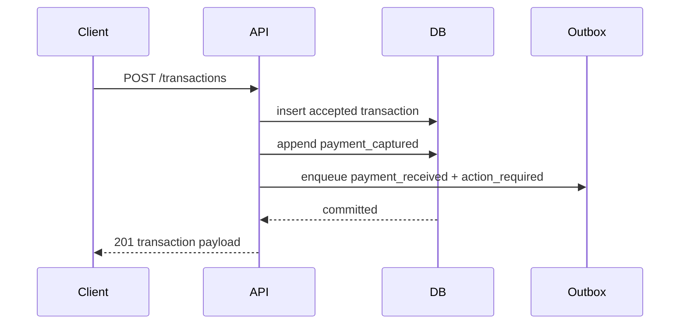

# GreJiJi API Reference

GreJiJi is a Node.js + SQLite backend for local marketplace escrow, disputes, and settlement tracking.

> [!NOTE]
> The live HTML version of this reference is served by the app at `GET /docs`.

## Table of Contents

- [Runtime and configuration](#runtime-and-configuration)
- [Authentication model](#authentication-model)
- [Core workflow](#core-workflow)
- [Endpoint reference](#endpoint-reference)
- [Event and outbox model](#event-and-outbox-model)
- [Notification dispatch and inbox APIs](#notification-dispatch-and-inbox-apis)
- [Error semantics](#error-semantics)

## Runtime and configuration

| Variable | Default | Purpose |
| --- | --- | --- |
| `PORT` | `3000` | HTTP listen port |
| `HOST` | `0.0.0.0` | Bind host |
| `NODE_ENV` | `development` | Reflected by `/health` |
| `DATABASE_PATH` | `./data/grejiji.sqlite` | SQLite file path |
| `RELEASE_TIMEOUT_HOURS` | `72` | Auto-release grace period |
| `AUTH_TOKEN_SECRET` | `local-dev-secret-change-me` | HMAC signing secret |
| `AUTH_TOKEN_TTL_SECONDS` | `43200` | Token lifetime in seconds |
| `EVIDENCE_STORAGE_PATH` | `./data/dispute-evidence` | Local dispute evidence file root |
| `EVIDENCE_MAX_BYTES` | `5242880` | Max upload size (bytes) per evidence file |
| `REQUEST_BODY_MAX_BYTES` | `1048576` | Max JSON request payload size in bytes |
| `SERVICE_FEE_FIXED_CENTS` | `0` | Flat platform fee applied per transaction (cents) |
| `SERVICE_FEE_PERCENT` | `0` | Additional percent platform fee (supports decimals like `2.5`) |
| `SETTLEMENT_CURRENCY` | `USD` | 3-letter ISO code attached to settlement breakdown fields |
| `PAYMENT_PROVIDER` | `local` | Payment adapter (`local` or `stripe`) for authorize/capture + refund calls |
| `PAYMENT_LOCAL_DEFAULT_METHOD` | `pm_local_dev` | Local provider marker persisted in reconciliation metadata |
| `STRIPE_SECRET_KEY` | unset | Required when `PAYMENT_PROVIDER=stripe` |
| `STRIPE_WEBHOOK_SECRET` | unset | Required to verify `POST /webhooks/stripe` signatures |
| `STRIPE_WEBHOOK_TOLERANCE_SECONDS` | `300` | Max clock skew allowed for Stripe webhook signature timestamps |
| `STRIPE_API_BASE_URL` | `https://api.stripe.com/v1` | Stripe API host override (advanced/testing) |
| `STRIPE_TIMEOUT_MS` | `10000` | Provider request timeout in milliseconds |
| `STRIPE_DEFAULT_PAYMENT_METHOD` | `pm_card_visa` | Server-side Stripe payment method for controlled launch/testing |
| `RATE_LIMIT_ENABLED` | `true` | Enables route-level write throttling |
| `RATE_LIMIT_WINDOW_MS` | `60000` | Shared per-IP throttling window |
| `RATE_LIMIT_AUTH_MAX` | `20` | Max auth writes per IP/window |
| `RATE_LIMIT_LISTINGS_WRITE_MAX` | `60` | Max listing writes per IP/window |
| `RATE_LIMIT_TRANSACTIONS_WRITE_MAX` | `60` | Max transaction/evidence writes per IP/window |
| `RATE_LIMIT_DISPUTE_WRITE_MAX` | `40` | Max dispute resolution writes per IP/window |
| `RATE_LIMIT_ADMIN_JOBS_MAX` | `30` | Max admin job writes per IP/window |
| `RATE_LIMIT_WEBHOOK_INTAKE_MAX` | `120` | Max webhook deliveries per IP/window |
| `RISK_VELOCITY_WINDOW_MINUTES` | `30` | Lookback window for transaction-velocity anomaly checks |
| `RISK_VELOCITY_THRESHOLD` | `5` | Velocity threshold before `velocity_anomaly` is recorded |
| `RISK_DISPUTE_WINDOW_HOURS` | `24` | Lookback window for repeated dispute-open checks |
| `RISK_DISPUTE_THRESHOLD` | `3` | Dispute-open threshold before `dispute_abuse` is recorded |
| `RISK_LIMIT_LOW_MAX_TRANSACTION_CENTS` | `500000` | Max transaction amount for low-tier accounts |
| `RISK_LIMIT_MEDIUM_MAX_TRANSACTION_CENTS` | `250000` | Max transaction amount for medium-tier accounts |
| `RISK_LIMIT_HIGH_MAX_TRANSACTION_CENTS` | `100000` | Max transaction amount for high-tier accounts |
| `RISK_LIMIT_LOW_DAILY_VOLUME_CAP_CENTS` | `1500000` | 24h volume cap for low-tier accounts |
| `RISK_LIMIT_MEDIUM_DAILY_VOLUME_CAP_CENTS` | `750000` | 24h volume cap for medium-tier accounts |
| `RISK_LIMIT_HIGH_DAILY_VOLUME_CAP_CENTS` | `250000` | 24h volume cap for high-tier accounts |
| `RISK_LIMIT_LOW_PAYOUT_COOLDOWN_HOURS` | `0` | Payout delay after acceptance for low-tier accounts |
| `RISK_LIMIT_MEDIUM_PAYOUT_COOLDOWN_HOURS` | `6` | Payout delay after acceptance for medium-tier accounts |
| `RISK_LIMIT_HIGH_PAYOUT_COOLDOWN_HOURS` | `24` | Payout delay after acceptance for high-tier accounts |
| `RISK_LIMIT_UNVERIFIED_MAX_TRANSACTION_CENTS` | `75000` | Verification-state cap applied on top of tier limits (`unverified`) |
| `RISK_LIMIT_PENDING_MAX_TRANSACTION_CENTS` | `150000` | Verification-state cap applied on top of tier limits (`pending`) |
| `RISK_LIMIT_UNVERIFIED_DAILY_VOLUME_CAP_CENTS` | `200000` | Verification-state 24h volume cap (`unverified`) |
| `RISK_LIMIT_PENDING_DAILY_VOLUME_CAP_CENTS` | `350000` | Verification-state 24h volume cap (`pending`) |
| `TRUST_OPS_AUTO_HOLD_RISK_SCORE` | `70` | Risk-score threshold for automated protective hold recommendations |
| `TRUST_OPS_CLEAR_RISK_SCORE` | `30` | Risk-score threshold for automated clear recommendations on policy holds |
| `TRUST_OPS_HOLD_DURATION_HOURS` | `24` | Default expiration window for policy-applied holds |
| `TRUST_OPS_RECOMPUTE_DEFAULT_LIMIT` | `100` | Default scan size for trust-operations recompute and simulation |
| `TRUST_OPS_RECOMPUTE_HARD_LIMIT` | `500` | Hard cap for trust-operations recompute and simulation scan size |
| `LISTINGS_CACHE_TTL_MS` | `1500` | In-memory cache TTL for `GET /listings` responses (`0` disables cache) |
| `LISTINGS_CACHE_MAX_ENTRIES` | `64` | Max cached listing-query entries before oldest eviction |
| `TRANSACTION_CACHE_TTL_MS` | `750` | In-memory cache TTL for `GET /transactions/:id` responses (`0` disables cache) |
| `TRANSACTION_CACHE_MAX_ENTRIES` | `512` | Max cached transaction snapshots before oldest eviction |
| `NOTIFICATION_DISPATCH_DEFAULT_LIMIT` | `100` | Default batch size for `/jobs/notification-dispatch` when no `limit` is provided |
| `NOTIFICATION_DISPATCH_HARD_LIMIT` | `250` | Hard cap for `/jobs/notification-dispatch` `limit` |
| `NOTIFICATION_DISPATCH_DEFAULT_MAX_PROCESSING_MS` | `300` | Default processing time budget per dispatch run |
| `PAYMENT_RECONCILIATION_DEFAULT_LIMIT` | `100` | Default transaction scan limit for `/jobs/payment-reconciliation` |
| `PAYMENT_RECONCILIATION_HARD_LIMIT` | `300` | Hard cap for `/jobs/payment-reconciliation` `limit` |
| `LISTING_POLICY_BLOCKED_KEYWORDS` | `weapon,drugs,counterfeit,stolen` | Comma-separated blocked terms for listing create/update policy checks |
| `LISTING_POLICY_PRICE_HIGH_MULTIPLIER` | `5` | Upper ratio threshold vs seller baseline average before review |
| `LISTING_POLICY_PRICE_LOW_MULTIPLIER` | `0.2` | Lower ratio threshold vs seller baseline average before review |
| `LISTING_POLICY_PRICE_BASELINE_MIN_SAMPLES` | `3` | Minimum seller listing sample size before price anomaly checks apply |
| `LISTING_ABUSE_AUTO_HIDE_THRESHOLD` | `3` | Open abuse-report threshold that auto-hides approved listings |
| `REQUEST_LOG_ENABLED` | `true` | Structured JSON request logs to stdout |
| `ERROR_EVENT_LOG_FILE` | unset | Optional JSONL file sink for request errors |

Auto-release timing is derived as:

$$
t_{auto\_release} = t_{accepted} + (releaseTimeoutHours \times 3600)
$$

## Authentication model

- `POST /auth/register` creates a user and returns a signed bearer token.
- `POST /auth/login` validates credentials and returns a fresh bearer token.
- Protected routes require `Authorization: Bearer <token>`.
- Valid roles are `buyer`, `seller`, and `admin`.

> [!TIP]
> When a buyer creates a transaction, the server forces `buyerId` to the authenticated user. When a seller creates a transaction, the server forces `sellerId` to the authenticated user.

## Core workflow



## Endpoint reference

### Health and discovery

#### `GET /`

Returns a minimal service status payload.

Response:

```json
{
  "message": "GreJiJi API baseline is running"
}
```

#### `GET /health`

Returns process-level health metadata.

Response:

```json
{
  "status": "ok",
  "service": "grejiji-api",
  "env": "development"
}
```

#### `GET /ready`

Returns dependency readiness metadata suitable for load balancer readiness checks.

Response:

```json
{
  "status": "ready",
  "service": "grejiji-api",
  "db": "ok"
}
```

#### `GET /docs`

Returns the user-facing HTML documentation page that can be shipped beside the live app.

#### `GET /app`

Returns the API-backed marketplace console for manual end-to-end testing of buyer, seller, and admin flows (dispute queue/detail, listing moderation actions, and risk hold/unhold interventions).

Related asset routes:

- `GET /app/client.js`
- `GET /app/styles.css`

### Provider webhook and reconciliation operations

#### `POST /webhooks/stripe`

Public endpoint (no bearer auth). Verifies Stripe signatures using `STRIPE_WEBHOOK_SECRET`, persists webhook records for audit/replay, deduplicates by provider event id, and processes idempotently.

Operational responses:

- invalid signature -> `400` with persisted `failed` webhook row
- duplicate delivery of an already processed event -> `200` with `duplicate_delivery` reason
- out-of-order historical event -> `200` with `out_of_order_ignored` reason
- per-route webhook throttle exceeded -> `429` (`routeKey: webhookIntake`)

#### `GET /admin/payment-webhooks`

Admin-only. Lists webhook audit rows.

Query params:

- `status`: optional `received | processed | failed`
- `provider`: optional provider filter (currently `stripe`)
- `limit`: optional integer (`1..500`, default `100`)

#### `POST /admin/payment-webhooks/:eventRowId/reprocess`

Admin-only. Requeues a failed webhook row and safely reprocesses it.

#### `POST /jobs/payment-reconciliation`

Admin-only. Reconciles local transaction payment status with latest processed provider webhook truth.

Request body:

```json
{
  "limit": 100
}
```

`limit` defaults to `PAYMENT_RECONCILIATION_DEFAULT_LIMIT` and cannot exceed
`PAYMENT_RECONCILIATION_HARD_LIMIT`.

Response fields:

- `processedTransactionCount`
- `correctedCount`
- `corrections[]` containing transaction id, previous status, corrected status, and source event references
- `ranAt`

#### `POST /jobs/trust-operations/recompute`

Admin-only continuous trust-operations sweep. Evaluates recent transactions against policy thresholds and optionally applies automated protective holds/clears and queue-case updates. Supports direct policy input or a `policyVersionId` lookup.

Request body:

```json
{
  "limit": 100,
  "apply": true,
  "policyVersionId": 3,
  "policy": {
    "autoHoldRiskScore": 70,
    "clearRiskScore": 30,
    "holdDurationHours": 24
  },
  "cohort": {
    "minAmountCents": 10000,
    "maxAmountCents": 30000,
    "riskLevelAllowlist": ["high"]
  }
}
```

#### `POST /jobs/trust-operations/recovery/process`

Admin-only recovery automation worker for queued false-positive unwind/release jobs.

Request body:

```json
{
  "limit": 50
}
```

### Risk and intervention operations

#### `GET /admin/risk-signals`

Admin-only. Query persisted risk signals for investigations.

Query params:

- `transactionId` (optional)
- `userId` (optional)
- `signalType` (optional): `auth_failures` | `velocity_anomaly` | `payment_mismatch` | `dispute_abuse` | `webhook_abuse` | `manual_review`
- `limit` (optional integer `1..500`, default `100`)

#### `GET /admin/transactions/:transactionId/risk`

Admin-only. Returns transaction risk metadata, related risk signals, and intervention audit actions.

#### `POST /admin/transactions/:transactionId/risk/hold`

Admin-only. Places a manual hold that blocks transaction progression (`confirm-delivery`, dispute resolution/adjudication, and auto-release).

Request body:

```json
{
  "reason": "velocity anomaly under review",
  "notes": "manual safeguard"
}
```

#### `POST /admin/transactions/:transactionId/risk/unhold`

Admin-only. Clears a manual hold and records an intervention audit action.

#### `GET /admin/accounts/:userId/risk`

Admin-only. Returns account risk controls, risk signals, intervention action history, and risk-tier history.

#### `GET /admin/accounts/:userId/risk/limits`

Admin-only. Returns account-level transaction-limit decisions emitted at:

- `transaction_initiation`
- `payout_release`

Query params:

- `checkpoint` (optional)
- `limit` (optional integer `1..500`, default `100`)

#### `POST /admin/accounts/:userId/risk/override-tier`
#### `POST /admin/accounts/:userId/risk/clear-tier-override`

Admin-only tier controls. Override forces deterministic tier policy (`low|medium|high`) until cleared.

#### `POST /admin/accounts/:userId/risk/flag`
#### `POST /admin/accounts/:userId/risk/unflag`
#### `POST /admin/accounts/:userId/risk/require-verification`
#### `POST /admin/accounts/:userId/risk/clear-verification`
#### `GET /admin/accounts/:userId/integrity`

Admin-only account controls. Flagged or verification-required accounts are blocked from non-admin write actions until controls are cleared.
Integrity endpoint returns current seller-integrity score plus contributing reason factors.

#### `GET /admin/trust-operations/cases`

Admin-only trust-operations queue reader with SLA/severity/priority fields for investigator triage.

Query params:

- `status` (optional): `open` | `in_review` | `resolved`
- `transactionId` (optional)
- `limit` (optional integer `1..500`, default `100`)

#### `GET /admin/trust-operations/cases/:caseId`

Admin-only trust-operations case detail including immutable case event history, internal case notes, payout-risk timeline entries, listing-authenticity forensics signals, and remediation-action audit history.

#### `GET /admin/trust-operations/cases/:caseId/intervention-preview`

Admin-only v10 intervention preview endpoint. Returns case-level proactive interdiction score, confidence tier, planned remediation actions, and explicit machine/human decision boundaries before override.

#### `GET /admin/trust-operations/cases/:caseId/challenges`
#### `POST /admin/trust-operations/cases/:caseId/challenges`
#### `POST /admin/trust-operations/challenges/:challengeId/resolve`

Admin-only step-up challenge workflow for high-risk identity gating. Challenge create/resolve actions are linked back to the trust case via immutable case-event audit rows.

#### `GET /admin/trust-operations/network/investigation`

Admin-only graph investigation reader for linked-entity context (`transactionId`, `userId`, or `clusterId`). Includes graph nodes/edges, linked-case expansion, and intervention rationale cards for active trust cases.

#### `POST /admin/trust-operations/network/signals`

Admin-only graph signal ingestion endpoint. Upserts link evidence across account/device/payment-instrument/interaction/fulfillment-endpoint/communication-fingerprint/listing-interaction entities with confidence and propagation scoring.

#### `GET /admin/trust-operations/policies`
#### `POST /admin/trust-operations/policies`
#### `POST /admin/trust-operations/policies/:policyVersionId/activate`

Admin-only policy versioning APIs for draft/active/retired policy lifecycle and cohort-targeted rollout windows.

#### `POST /admin/trust-operations/backtest`

Admin-only replay/backtest endpoint. Evaluates a policy version (or inline policy) against recent transaction history and returns an impact summary plus payout-action deltas versus active policy.

#### `POST /admin/trust-operations/cases/:caseId/approve`
#### `POST /admin/trust-operations/cases/:caseId/override`
#### `POST /admin/trust-operations/cases/:caseId/clear`

Admin-only trust-operations case actions. All actions require `reasonCode` and append immutable case-event audit entries.

#### `POST /admin/trust-operations/cases/:caseId/assign`
#### `POST /admin/trust-operations/cases/:caseId/claim`
#### `POST /admin/trust-operations/cases/:caseId/notes`
#### `POST /admin/trust-operations/cases/:caseId/evidence-bundle/export`
#### `POST /admin/trust-operations/cases/bulk-action`
#### `POST /admin/trust-operations/cases/:caseId/cluster-preview`
#### `POST /admin/trust-operations/cases/:caseId/cluster-apply`

Admin-only investigator workflow and bulk-action APIs with required `reasonCode` enforcement and per-case immutable audit fan-out.
Evidence-bundle export returns v10 case forensics payloads, intervention rationale, remediation timeline, and decision-boundary context.

#### `POST /admin/trust-operations/simulate-policy`

Admin-only dry-run policy simulator. Returns recommended actions, severity/priority/SLA projections, and cohort-match summary without mutating transaction or case state.

#### `POST /admin/trust-operations/feedback`

Admin-only closed-loop feedback ingestion for operator actions, dispute outcomes, and chargeback outcomes used by policy tuning recommendations.

#### `GET /admin/trust-operations/policy-recommendations`
#### `GET /admin/trust-operations/dashboard`
#### `GET /admin/trust-operations/payout-risk/metrics`
#### `GET /admin/trust-operations/recovery/queue`

Admin-only decision-quality and tuning APIs exposing false-positive rate, override/reversal metrics, case aging, recommendation snapshots, and payout-risk quality telemetry (`falsePositiveReleaseRate`, `preventedLossEstimateCents`, payout-delay distribution, `overrideDriftRate`).
Dashboard metrics also include `preemptiveDisputeControls` rates for shipment-confirmation requirements, payout-progression restrictions, and conditional escrow delays, plus v10 `interdictionV10` telemetry (remediation applied/rolled-back counts, rollback rate, and listing-authenticity signal metrics).

#### `POST /accounts/me/verification-submissions`

Buyer/seller endpoint. Creates or refreshes an identity verification submission and sets account status to `pending`.

#### `GET /admin/verification-submissions`

Admin-only. Lists accounts by verification status (`pending` by default) for queue review.

#### `GET /admin/accounts/:userId/verification`

Admin-only. Returns current verification profile plus immutable verification transition history.

#### `POST /admin/accounts/:userId/verification/approve`
#### `POST /admin/accounts/:userId/verification/reject`

Admin-only. Completes verification review with auditable status transition and notes.

#### `GET /admin/accounts/:userId/identity-assurance`

Admin-only identity posture endpoint exposing verification, credential-age, device-continuity, and risk-weighted history factors plus blended assurance score.

#### `GET /admin/accounts/:userId/recovery`
#### `POST /admin/accounts/:userId/recovery/start`
#### `POST /admin/accounts/:userId/recovery/approve-stage`

Admin-only staged account-compromise recovery workflow with explicit approval checkpoints (`lockdown` -> `identity_reverification` -> `limited_restore` -> `full_restore`) and auditable restoration state.

#### `GET /admin/launch-control/flags`

Admin-only. Returns launch-control flags resolved for the active environment.

#### `POST /admin/launch-control/flags/:flagKey`

Admin-only. Updates a launch-control flag with auditable metadata.

Request body (all fields optional except `reason` in operational practice):

```json
{
  "enabled": true,
  "rolloutPercentage": 25,
  "allowlistUserIds": ["buyer-canary-1"],
  "regionAllowlist": ["CA-ON"],
  "reason": "canary enable for checkout",
  "deploymentRunId": "deploy-2026-04-10.1"
}
```

Supported `flagKey` values:

- `transaction_initiation`
- `payout_release`
- `dispute_auto_transitions`
- `moderation_auto_actions`

#### `GET /admin/launch-control/audit`

Admin-only. Returns launch-control flag change history with actor, reason, correlation, and deployment metadata.

Query params:

- `key` (optional flag key)
- `limit` (optional integer `1..500`, default `100`)

#### `GET /admin/launch-control/incidents`

Admin-only. Returns persisted launch-control incident records.

Query params:

- `limit` (optional integer `1..500`, default `100`)

#### `POST /jobs/launch-control/auto-rollback`

Admin-only incident hook. Evaluates SLO/alert signals and disables configured launch-control flags when thresholds are breached.

Request body:

```json
{
  "incidentKey": "inc-2026-04-10-burn",
  "signalType": "slo_breach",
  "severity": "critical",
  "burnRate": 3.2,
  "errorRate": 0.08,
  "webhookFailureCount": 8,
  "affectedFlags": ["transaction_initiation", "payout_release"],
  "force": false
}
```

### Auth

#### `POST /auth/register`

Request body:

```json
{
  "email": "buyer@example.com",
  "password": "buyer-password",
  "role": "buyer",
  "userId": "buyer-1"
}
```

Rules:

- `email`, `password`, and `role` are required.
- `password` must be at least 8 characters.
- `role` must be one of `buyer`, `seller`, `admin`.
- Duplicate email returns `409`.

#### `POST /auth/login`

Request body:

```json
{
  "email": "buyer@example.com",
  "password": "buyer-password"
}
```

### Listings

#### `GET /listings`

Public listing feed ordered by newest first.

Optional query params:

- `limit` (default `100`, max `500`)
- `sellerId` (exact seller filter)
- `localArea` (exact area filter)
- `cursorCreatedAt` and `cursorId` (pass both together for keyset pagination)

#### `POST /listings`

Seller-only.

Request body:

```json
{
  "listingId": "listing-1",
  "title": "Bike",
  "description": "Road bike",
  "priceCents": 25000,
  "category": "sports",
  "itemCondition": "used",
  "localArea": "Toronto"
}
```

Validation:

- `title` required
- `localArea` required
- `priceCents` must be a positive integer
- policy checks on create/update can auto-assign moderation states:
  - `approved`
  - `pending_review` (metadata incomplete or price anomaly)
  - `rejected` (prohibited content)

#### `PATCH /listings/:listingId`

Seller-only, and only the owning seller may update the listing.

Create/update responses include `listing.sellerFeedback` when moderation is not `approved`.

#### `POST /listings/:listingId/abuse-reports`

Authenticated users can report suspicious listings for moderation triage.

Request body:

```json
{
  "reasonCode": "suspicious_listing",
  "details": "mismatch between photos and listing text"
}
```

When open reports reach `LISTING_ABUSE_AUTO_HIDE_THRESHOLD`, approved listings are automatically moved to `temporarily_hidden`.

#### `GET /admin/listings/moderation`

Admin-only moderation queue.

Query params:

- `status` (default `pending_review`)
- `limit` (default `100`, max `500`)

#### `GET /admin/listings/:listingId/moderation`

Admin-only moderation detail view. Returns listing snapshot, moderation transition audit events, and abuse reports.

#### `POST /admin/listings/:listingId/moderation/approve`
#### `POST /admin/listings/:listingId/moderation/reject`
#### `POST /admin/listings/:listingId/moderation/hide`
#### `POST /admin/listings/:listingId/moderation/unhide`

Admin-only listing moderation actions. All transitions are written to moderation audit history.

### Transactions

#### `POST /transactions`

Authenticated. Creates an accepted transaction, executes provider authorize/capture, and records `payment_captured`.

Example seller-authenticated request:

```json
{
  "transactionId": "txn-100",
  "buyerId": "buyer-1",
  "amountCents": 12000,
  "acceptedAt": "2026-04-09T12:00:00.000Z"
}
```

Required server-side invariants:

- `id`, `buyerId`, and `sellerId` must resolve before persistence.
- `amountCents` must be a positive integer.
- `autoReleaseDueAt` is computed automatically.
- `serviceFee`, `totalBuyerCharge`, `sellerNet`, and `currency` are persisted at creation and returned on read APIs.
- `paymentProvider`, `paymentStatus`, `providerPaymentIntentId`, `providerChargeId`, and `providerLastRefundId` are returned for reconciliation/audit.
- Settlement outcomes (`completed`, `refunded`, `cancelled`) persist immutable final snapshot fields:
  `settledBuyerCharge`, `settledSellerPayout`, and `settledPlatformFee`.

#### `GET /transactions/:transactionId`

Visible to participants or admins only.

#### `GET /transactions/:transactionId/events`

Visible to participants or admins only. Returns chronological lifecycle history ordered by `occurredAt ASC, id ASC`.

#### `POST /transactions/:transactionId/confirm-delivery`

Buyer-only for the buyer attached to the transaction.

Effect:

- marks transaction `completed`
- sets `payoutReleaseReason` to `buyer_confirmation`
- emits `buyer_confirmed` and `settlement_completed`

#### `POST /transactions/:transactionId/acknowledge-completion`

Seller-only for the seller attached to the transaction, and only after transaction status is `completed`.

Effect:

- records `sellerCompletionAcknowledgedAt` for auditable two-sided closure confirmation
- rejects duplicates with `409`

#### `POST /transactions/:transactionId/disputes`

Participant-only.

Effect:

- moves transaction to `disputed`
- emits `dispute_opened`

#### `POST /transactions/:transactionId/disputes/resolve`

Admin-only.

Effect:

- returns transaction to `accepted`
- emits `dispute_resolved`

#### `POST /transactions/:transactionId/disputes/adjudicate`

Admin-only.

Request body:

```json
{
  "decision": "refund_to_buyer",
  "notes": "item not delivered"
}
```

Valid `decision` values:

- `release_to_seller`
- `refund_to_buyer`
- `cancel_transaction`

Settlement mapping:

- `release_to_seller` -> `settlement_completed`
- `refund_to_buyer` -> `settlement_refunded`
- `cancel_transaction` -> `settlement_cancelled`

#### `POST /transactions/:transactionId/disputes/evidence`

Participant-only (buyer/seller linked to transaction). Uploads a dispute evidence file from base64 content and stores metadata.

Request body:

```json
{
  "evidenceId": "evidence-1",
  "fileName": "receipt.txt",
  "mimeType": "text/plain",
  "contentBase64": "cHJvb2Y=",
  "checksumSha256": "optional-hex-sha256"
}
```

Validation:

- transaction must currently be `disputed`
- `fileName` required, max 255 chars
- `mimeType` required
- `contentBase64` must be valid base64 and decode under `EVIDENCE_MAX_BYTES`
- optional `checksumSha256` must match decoded content

#### `GET /transactions/:transactionId/disputes/evidence`

Visible to participants or admins only. Returns ordered evidence metadata.

#### `GET /transactions/:transactionId/disputes/evidence/:evidenceId/download`

Visible to participants or admins only. Streams the stored evidence file using persisted `mimeType`.

#### `POST /transactions/:transactionId/ratings`

Participant-only (buyer/seller linked to transaction). Submits exactly one rating per rater per transaction.

Request body:

```json
{
  "score": 5,
  "comment": "Optional feedback text"
}
```

Rules:

- `score` must be an integer in `1..5`
- transaction must be `completed`
- duplicate submissions from the same rater on the same transaction return `409`

#### `GET /transactions/:transactionId/ratings`

Visible to participants or admins only.

Returns:

- `trust.ratings[]` (submitted ratings)
- `trust.ratingsState` (`pending` or `complete`)
- `trust.pendingBy` (`buyer` and/or `seller` while waiting)
- participant reputation snapshots in `trust.reputation`

#### `GET /users/:userId/reputation`

Public reputation summary endpoint used by listing and transaction surfaces.

Returns aggregate metrics (`ratingCount`, `averageScore`, `minScore`, `maxScore`) and recent ratings.

#### `GET /admin/disputes`

Admin-only dispute queue.

Query params:

- `filter`: `open` | `needs_evidence` | `awaiting_decision` | `resolved`
- `sortBy`: `updatedAt` | `disputeOpenedAt` | `disputeResolvedAt` | `autoReleaseDueAt` | `disputeAgeHours` | `autoReleaseOverdueHours` | `evidenceCount`
- `sortOrder`: `asc` | `desc`
- `nowAt` (optional ISO timestamp) for deterministic SLA calculations

Queue items include transaction state, evidence count, latest evidence timestamp, and SLA-style fields such as `disputeAgeHours` and `autoReleaseOverdueHours`.

#### `GET /admin/disputes/:transactionId`

Admin-only dispute detail endpoint for reviewer workflows.

Includes:

- `transaction` snapshot
- `evidence` metadata list
- `riskSignals` and `riskActions` history
- full dispute timeline (`events`)
- `adjudicationActions` subset (resolve/adjudicate/settlement events)

#### `POST /jobs/auto-release`

Admin-only. Processes eligible accepted transactions whose `autoReleaseDueAt` has passed and no unresolved dispute exists.

Optional request body:

```json
{
  "nowAt": "2026-04-12T12:00:00.000Z"
}
```

#### `POST /jobs/notification-dispatch`

Admin-only. Processes dispatchable outbox rows (`pending` or retryable `failed`) and writes user-facing notifications idempotently.

Optional request body:

```json
{
  "nowAt": "2026-04-12T12:00:00.000Z",
  "limit": 100,
  "maxProcessingMs": 300
}
```

- `limit` defaults to `NOTIFICATION_DISPATCH_DEFAULT_LIMIT` and cannot exceed
  `NOTIFICATION_DISPATCH_HARD_LIMIT`.
- `maxProcessingMs` defaults to `NOTIFICATION_DISPATCH_DEFAULT_MAX_PROCESSING_MS` and must be `1..60000`.

### Notification inbox

#### `GET /notifications`

Authenticated route. Returns only notifications belonging to the current user.

Optional query string:

- `limit` (default `100`, max `500`)

#### `POST /notifications/:notificationId/read`

Authenticated route. Marks owned notifications as `read` (idempotent with existing `acknowledged` status preserved).

#### `POST /notifications/:notificationId/acknowledge`

Authenticated route. Marks owned notifications as `acknowledged` and stamps `acknowledgedAt`.

## Event and outbox model

Events are immutable rows in `transaction_events`.

Supported event types:

- `payment_captured`
- `buyer_confirmed`
- `dispute_opened`
- `dispute_resolved`
- `dispute_adjudicated`
- `settlement_completed`
- `settlement_refunded`
- `settlement_cancelled`

Notification side effects are written atomically to `notification_outbox`.

Supported topics:

- `payment_received`
- `action_required`
- `dispute_update`

Outbox dispatch metadata:

- `attempt_count`
- `last_attempt_at`
- `next_retry_at`
- `processing_started_at`
- `processed_at`

Delivered user inbox rows are persisted in `user_notifications` with statuses:

- `unread`
- `read`
- `acknowledged`

## Notification dispatch and inbox APIs





## Web console

The app also ships a lightweight browser console for operational walkthroughs and demos.

Capabilities exposed by the current UI:

- register and login for `buyer`, `seller`, and `admin`
- browse listings and create seller-owned listings
- create and inspect transactions
- confirm delivery or open disputes as a participant
- upload and download dispute evidence
- review the admin dispute queue and dispute detail view
- read and acknowledge inbox notifications

> [!TIP]
> No frontend build step is required. The server returns the HTML shell and static browser assets directly from `/app`, `/app/client.js`, and `/app/styles.css`.

> [!WARNING]
> Auto-release skips transactions with an unresolved dispute. A dispute must be resolved or adjudicated before settlement can progress.

## Error semantics

The server maps domain errors consistently:

| Code | Meaning |
| --- | --- |
| `400` | validation failures |
| `403` | auth or role violations |
| `404` | missing resources |
| `409` | state conflict or duplicate identifier |
| `429` | route-level rate limit exceeded |
| `500` | unexpected internal failure |
