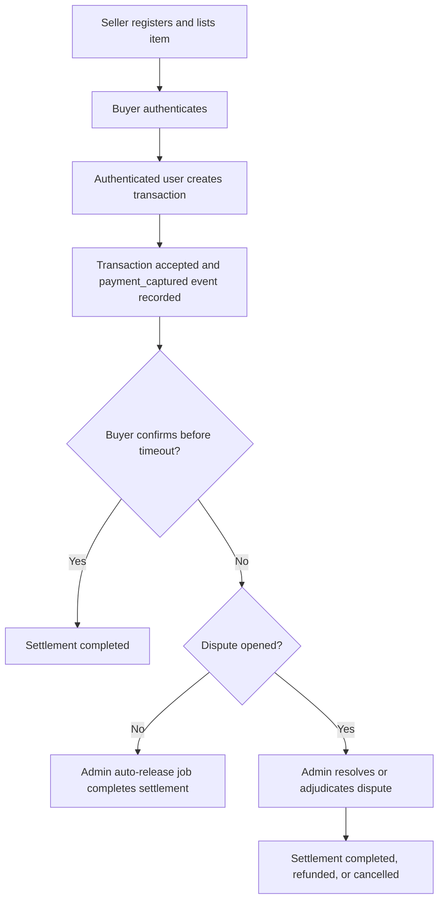
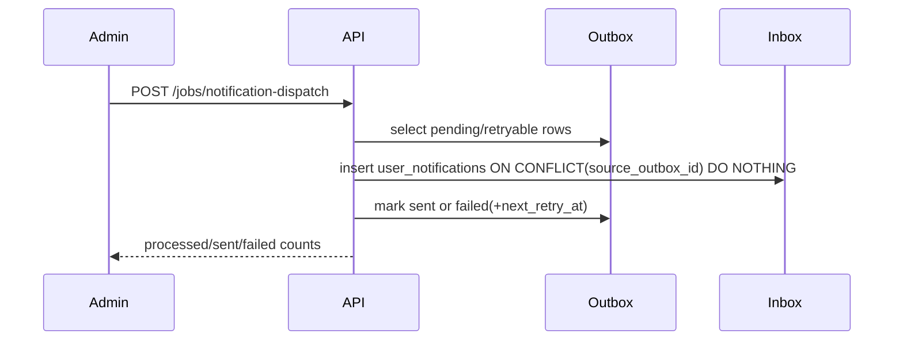
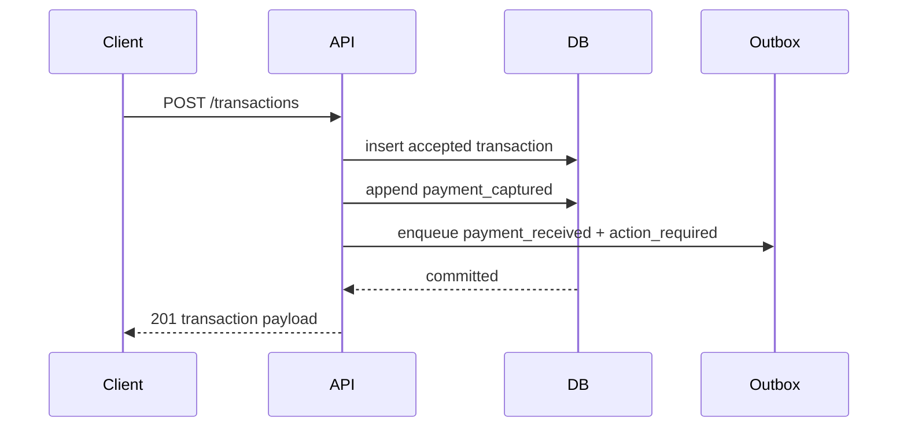

# GreJiJi API Reference

GreJiJi is a Node.js + SQLite backend for local marketplace escrow, disputes, and settlement tracking.

> [!NOTE]
> The live HTML version of this reference is served by the app at `GET /docs`.

## Table of Contents

- [Runtime and configuration](#runtime-and-configuration)
- [Authentication model](#authentication-model)
- [Core workflow](#core-workflow)
- [Endpoint reference](#endpoint-reference)
- [Trust assessment model](#trust-assessment-model)
- [Event and outbox model](#event-and-outbox-model)
- [Notification dispatch and inbox APIs](#notification-dispatch-and-inbox-apis)
- [Error semantics](#error-semantics)

## Runtime and configuration

| Variable | Default | Purpose |
| --- | --- | --- |
| `PORT` | `3000` | HTTP listen port |
| `HOST` | `0.0.0.0` | Bind host |
| `NODE_ENV` | `development` | Reflected by `/health` |
| `DATABASE_PATH` | `./data/grejiji.sqlite` | SQLite file path |
| `RELEASE_TIMEOUT_HOURS` | `72` | Auto-release grace period |
| `AUTH_TOKEN_SECRET` | `local-dev-secret-change-me` | HMAC signing secret |
| `AUTH_TOKEN_TTL_SECONDS` | `43200` | Token lifetime in seconds |
| `EVIDENCE_STORAGE_PATH` | `./data/dispute-evidence` | Local dispute evidence file root |
| `EVIDENCE_MAX_BYTES` | `5242880` | Max upload size (bytes) per evidence file |
| `SERVICE_FEE_FIXED_CENTS` | `0` | Flat platform fee applied per transaction (cents) |
| `SERVICE_FEE_PERCENT` | `0` | Additional percent platform fee (supports decimals like `2.5`) |
| `SETTLEMENT_CURRENCY` | `USD` | 3-letter ISO code attached to settlement breakdown fields |

Auto-release timing is derived as:

$$
t_{auto\_release} = t_{accepted} + (releaseTimeoutHours \times 3600)
$$

## Authentication model

- `POST /auth/register` creates a user and returns a signed bearer token.
- `POST /auth/login` validates credentials and returns a fresh bearer token.
- Protected routes require `Authorization: Bearer <token>`.
- Valid roles are `buyer`, `seller`, and `admin`.

> [!TIP]
> When a buyer creates a transaction, the server forces `buyerId` to the authenticated user. When a seller creates a transaction, the server forces `sellerId` to the authenticated user.

## Core workflow



## Endpoint reference

### Health and discovery

#### `GET /`

Returns a minimal service status payload.

Response:

```json
{
  "message": "GreJiJi API baseline is running"
}
```

#### `GET /health`

Returns process-level health metadata.

Response:

```json
{
  "status": "ok",
  "service": "grejiji-api",
  "env": "development"
}
```

#### `GET /docs`

Returns the user-facing HTML documentation page that can be shipped beside the live app.

#### `GET /app`

Returns the API-backed marketplace console for manual end-to-end testing of buyer, seller, and admin flows.

Related asset routes:

- `GET /app/client.js`
- `GET /app/styles.css`

### Auth

#### `POST /auth/register`

Request body:

```json
{
  "email": "buyer@example.com",
  "password": "buyer-password",
  "role": "buyer",
  "userId": "buyer-1"
}
```

Rules:

- `email`, `password`, and `role` are required.
- `password` must be at least 8 characters.
- `role` must be one of `buyer`, `seller`, `admin`.
- Duplicate email returns `409`.

#### `POST /auth/login`

Request body:

```json
{
  "email": "buyer@example.com",
  "password": "buyer-password"
}
```

### Listings

#### `GET /listings`

Public listing feed ordered by newest first.

#### `POST /listings`

Seller-only.

Request body:

```json
{
  "listingId": "listing-1",
  "title": "Bike",
  "description": "Road bike",
  "priceCents": 25000,
  "localArea": "Toronto"
}
```

Validation:

- `title` required
- `localArea` required
- `priceCents` must be a positive integer

#### `PATCH /listings/:listingId`

Seller-only, and only the owning seller may update the listing.

### Transactions

#### `POST /transactions`

Authenticated. Creates an accepted transaction and records `payment_captured`.

Example seller-authenticated request:

```json
{
  "transactionId": "txn-100",
  "buyerId": "buyer-1",
  "amountCents": 12000,
  "acceptedAt": "2026-04-09T12:00:00.000Z",
  "deviceFingerprint": "ios-17|iphone14|fp-abcd",
  "paymentFingerprint": "card-bin-424242|issuer-us|fp-xyz"
}
```

Required server-side invariants:

- `id`, `buyerId`, and `sellerId` must resolve before persistence.
- `amountCents` must be a positive integer.
- `autoReleaseDueAt` is computed automatically.
- `serviceFee`, `totalBuyerCharge`, `sellerNet`, and `currency` are persisted at creation and returned on read APIs.
- Optional `deviceFingerprint` and `paymentFingerprint` can be supplied to improve abuse-graph linkage quality.
- Settlement outcomes (`completed`, `refunded`, `cancelled`) persist immutable final snapshot fields:
  `settledBuyerCharge`, `settledSellerPayout`, and `settledPlatformFee`.

Trust payloads now include:

- `graphSignals` for abuse-neighborhood scoring across user/listing/device/payment/dispute entities.
- `evidenceProvenance` with immutable snapshot id/hash and lineage metadata.
- `outcomeFeedback` with bounded threshold calibration metadata.
- `explainability` with top risk paths, contribution percentages, and confidence decomposition for reviewer rationale.
- `identityFriction` with policy versioning, adaptive requirements, escalation level, and decision trace.
- `postIncidentVerification` with outcome drift metrics, regression flags, and actionable alert codes.
- `fraudRingDisruption` with multi-hop ring metrics, disruption score/band, and investigator artifacts.
- `escrowAdversarialSimulation` with coordinated attack scenarios, severity scores, and guardrail recommendations.
- `trustPolicyRollback` with autonomous rollback trigger state, pressure score, threshold deltas, and rollback artifacts.
- `accountTakeoverContainment` with correlated device/payment takeover scoring, graduated containment mode, and investigator evidence trails.
- `settlementRiskStressControls` with delayed-delivery, reversal-wave, and coordinated dispute-burst scenarios plus severity/confidence outputs.
- `policyCanaryGovernance` with canary cohort stages, degradation pressure, promote/hold/revert decisions, and rollback runbook references.

#### `GET /transactions/:transactionId`

Visible to participants or admins only.

#### `GET /transactions/:transactionId/events`

Visible to participants or admins only. Returns chronological lifecycle history ordered by `occurredAt ASC, id ASC`.

#### `GET /transactions/:transactionId/trust`

Visible to participants or admins only.

Response includes:

- `trustAssessment`: latest persisted assessment snapshot for the transaction
- `trustInterventions`: ordered intervention history including recommended controls, provenance refs, and v16 canary/containment fields

#### `POST /transactions/:transactionId/trust/evaluate`

Admin-only. Re-runs trust evaluation and appends a fresh intervention snapshot.

Optional request body:

```json
{
  "evaluatedBy": "admin-1",
  "evaluatedAt": "2026-04-11T12:00:00.000Z"
}
```

#### `POST /transactions/:transactionId/confirm-delivery`

Buyer-only for the buyer attached to the transaction.

Effect:

- marks transaction `completed`
- sets `payoutReleaseReason` to `buyer_confirmation`
- emits `buyer_confirmed` and `settlement_completed`

#### `POST /transactions/:transactionId/disputes`

Participant-only.

Effect:

- moves transaction to `disputed`
- emits `dispute_opened`

#### `POST /transactions/:transactionId/disputes/resolve`

Admin-only.

Effect:

- returns transaction to `accepted`
- emits `dispute_resolved`

#### `POST /transactions/:transactionId/disputes/adjudicate`

Admin-only.

Request body:

```json
{
  "decision": "refund_to_buyer",
  "notes": "item not delivered"
}
```

Valid `decision` values:

- `release_to_seller`
- `refund_to_buyer`
- `cancel_transaction`

Settlement mapping:

- `release_to_seller` -> `settlement_completed`
- `refund_to_buyer` -> `settlement_refunded`
- `cancel_transaction` -> `settlement_cancelled`

#### `POST /transactions/:transactionId/disputes/evidence`

Participant-only (buyer/seller linked to transaction). Uploads a dispute evidence file from base64 content and stores metadata.

Request body:

```json
{
  "evidenceId": "evidence-1",
  "fileName": "receipt.txt",
  "mimeType": "text/plain",
  "contentBase64": "cHJvb2Y=",
  "checksumSha256": "optional-hex-sha256"
}
```

Validation:

- transaction must currently be `disputed`
- `fileName` required, max 255 chars
- `mimeType` required
- `contentBase64` must be valid base64 and decode under `EVIDENCE_MAX_BYTES`
- optional `checksumSha256` must match decoded content

#### `GET /transactions/:transactionId/disputes/evidence`

Visible to participants or admins only. Returns ordered evidence metadata.

#### `GET /transactions/:transactionId/disputes/evidence/:evidenceId/download`

Visible to participants or admins only. Streams the stored evidence file using persisted `mimeType`.

#### `GET /admin/disputes`

Admin-only dispute queue.

Query params:

- `filter`: `open` | `needs_evidence` | `awaiting_decision` | `resolved`
- `sortBy`: `updatedAt` | `disputeOpenedAt` | `disputeResolvedAt` | `autoReleaseDueAt` | `disputeAgeHours` | `autoReleaseOverdueHours` | `evidenceCount`
- `sortOrder`: `asc` | `desc`
- `nowAt` (optional ISO timestamp) for deterministic SLA calculations

Queue items include transaction state, evidence count, latest evidence timestamp, and SLA-style fields such as `disputeAgeHours` and `autoReleaseOverdueHours`.

#### `GET /admin/disputes/:transactionId`

Admin-only dispute detail endpoint for reviewer workflows.

Includes:

- `transaction` snapshot
- `evidence` metadata list
- full dispute timeline (`events`)
- `adjudicationActions` subset (resolve/adjudicate/settlement events)

#### `POST /jobs/auto-release`

Admin-only. Processes eligible accepted transactions whose `autoReleaseDueAt` has passed and no unresolved dispute exists.

Optional request body:

```json
{
  "nowAt": "2026-04-12T12:00:00.000Z"
}
```

#### `POST /jobs/notification-dispatch`

Admin-only. Processes dispatchable outbox rows (`pending` or retryable `failed`) and writes user-facing notifications idempotently.

Optional request body:

```json
{
  "nowAt": "2026-04-12T12:00:00.000Z",
  "limit": 100
}
```

### Notification inbox

#### `GET /notifications`

Authenticated route. Returns only notifications belonging to the current user.

Optional query string:

- `limit` (default `100`, max `500`)

#### `POST /notifications/:notificationId/read`

Authenticated route. Marks owned notifications as `read` (idempotent with existing `acknowledged` status preserved).

#### `POST /notifications/:notificationId/acknowledge`

Authenticated route. Marks owned notifications as `acknowledged` and stamps `acknowledgedAt`.

## Event and outbox model

Events are immutable rows in `transaction_events`.

Supported event types:

- `payment_captured`
- `buyer_confirmed`
- `dispute_opened`
- `dispute_resolved`
- `dispute_adjudicated`
- `settlement_completed`
- `settlement_refunded`
- `settlement_cancelled`

Notification side effects are written atomically to `notification_outbox`.

Supported topics:

- `payment_received`
- `action_required`
- `dispute_update`

## Trust assessment model

Trust responses are versioned under `orchestrationVersion`. The current implementation emits `trust-ops-v16`.

> [!NOTE]
> The same v16 payload family is returned on transaction create/read flows and the dedicated trust route `GET /transactions/:transactionId/trust`.

### High-level shape

```json
{
  "trustAssessment": {
    "orchestrationVersion": "trust-ops-v16",
    "riskBand": "medium",
    "confidenceBand": "medium",
    "accountTakeoverContainment": {
      "containmentBand": "medium",
      "containmentMode": "guarded_containment",
      "recommendedActions": ["session_risk_annotation", "step_up_credential_reset"]
    },
    "settlementRiskStressControls": {
      "simulationMode": "delayed_delivery_reversal_dispute_burst",
      "maxScenarioSeverity": 58,
      "simulationConfidenceBand": "medium"
    },
    "policyCanaryGovernance": {
      "rolloutDecision": "hold",
      "autoReverted": false,
      "cohortPlan": { "stage0Percent": 5, "stage1Percent": 20, "stage2Percent": 40 }
    }
  }
}
```

### v16 domain components

| Field | Purpose | Notable nested outputs |
| --- | --- | --- |
| `accountTakeoverContainment` | Correlates shared device/payment transitions across linked entities and recommends graduated containment. | `correlationScore`, `containmentBand`, `containmentMode`, `recommendedActions`, `investigatorEvidenceTrail` |
| `settlementRiskStressControls` | Simulates delayed-delivery, reversal-wave, and coordinated dispute-burst stress against escrow cohorts. | `stressScenarios`, `maxScenarioSeverity`, `simulationConfidenceBand`, `projectedLossBps`, `recommendedControls` |
| `policyCanaryGovernance` | Governs guarded policy rollout with automatic hold/revert behavior when degradation pressure breaches thresholds. | `rolloutDecision`, `autoReverted`, `degradationPressure`, `rollbackThresholds`, `cohortPlan`, `guardrailActions` |

### Persistence and migrations

- Migration `migrations/012_trust_operations_v16.sql` adds `account_takeover_containment_json`, `settlement_risk_stress_controls_json`, and `policy_canary_governance_json` to both `trust_assessments` and `trust_interventions`.
- Trust assessment reads expose the latest snapshot, while `trustInterventions` returns the historical decision trail attached to the transaction.
- Backward-compatible exports for v12-v15 call the same v16 evaluator, but newly persisted rows are stamped as `trust-ops-v16`.

### Operator interpretation

- `rolloutDecision = promote` means the canary stayed beneath degradation pressure thresholds and may advance to the next cohort.
- `rolloutDecision = hold` means extend observation while preserving current thresholds and cohort limits.
- `rolloutDecision = revert` means rollback guardrails triggered automatically or regression pressure was high enough to force a canary revert.
- High `accountTakeoverContainment.correlationScore` should be read with its `investigatorEvidenceTrail` before freezing linked entities.
- High `settlementRiskStressControls.maxScenarioSeverity` indicates settlement operations should favor manual release confirmation and reversal buffers.

Outbox dispatch metadata:

- `attempt_count`
- `last_attempt_at`
- `next_retry_at`
- `processing_started_at`
- `processed_at`

Delivered user inbox rows are persisted in `user_notifications` with statuses:

- `unread`
- `read`
- `acknowledged`

## Notification dispatch and inbox APIs





## Web console

The app also ships a lightweight browser console for operational walkthroughs and demos.

Capabilities exposed by the current UI:

- register and login for `buyer`, `seller`, and `admin`
- browse listings and create seller-owned listings
- create and inspect transactions
- confirm delivery or open disputes as a participant
- upload and download dispute evidence
- review the admin dispute queue and dispute detail view
- read and acknowledge inbox notifications

> [!TIP]
> No frontend build step is required. The server returns the HTML shell and static browser assets directly from `/app`, `/app/client.js`, and `/app/styles.css`.

> [!WARNING]
> Auto-release skips transactions with an unresolved dispute. A dispute must be resolved or adjudicated before settlement can progress.

## Error semantics

The server maps domain errors consistently:

| Code | Meaning |
| --- | --- |
| `400` | validation failures |
| `403` | auth or role violations |
| `404` | missing resources |
| `409` | state conflict or duplicate identifier |
| `500` | unexpected internal failure |
