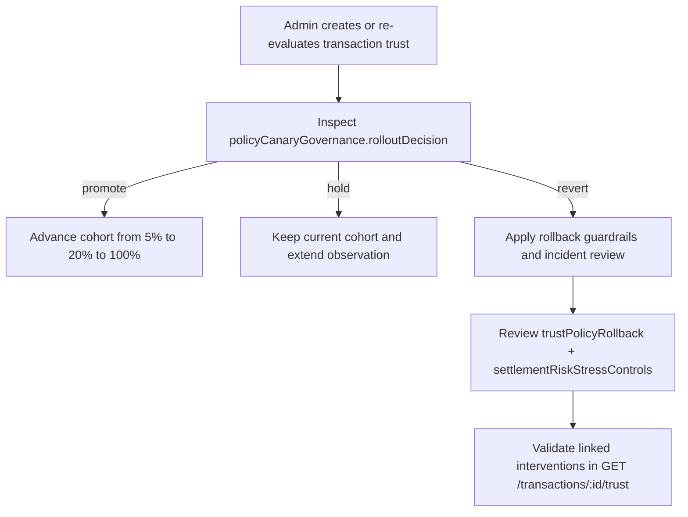

# GreJiJi Operations Guide

This guide covers local execution, testing, storage layout, and verification steps for the current service build.

## Table of Contents

- [Local setup](#local-setup)
- [Verification checklist](#verification-checklist)
- [Persistence model](#persistence-model)
- [Trust operations v16 runbook](#trust-operations-v16-runbook)
- [Useful local inspection commands](#useful-local-inspection-commands)
- [Release-sensitive behavior](#release-sensitive-behavior)
- [Test coverage currently included](#test-coverage-currently-included)

## Local setup

```bash
npm install
npm start
```

The service listens on `http://0.0.0.0:3000` by default.

Primary local surfaces:

- API root: `GET /`
- HTML docs: `GET /docs`
- Web console: `GET /app`

## Verification checklist

> [!NOTE]
> The current automated verification source of truth is `node --test`.

1. Start the app with a clean SQLite path.
2. Open `GET /docs` and confirm the HTML reference loads.
3. Open `GET /app` and confirm the browser console loads its shell and assets.
4. Run `npm test`.
5. Exercise at least one auth, listing, transaction, trust, and inbox flow if doing manual QA.

> [!TIP]
> For the trust flow, create two transactions that share a `deviceFingerprint` or `paymentFingerprint`, then inspect `GET /transactions/:transactionId/trust` to confirm v16 containment and canary outputs.

## Persistence model

Primary tables created by migrations:

- `users`
- `listings`
- `transactions`
- `transaction_events`
- `notification_outbox`
- `user_notifications`
- `dispute_evidence`
- `trust_assessments`
- `trust_interventions`
- `trust_signal_snapshots`
- `transaction_risk_entities`
- `schema_migrations`

Runtime file storage:

- dispute evidence files are written beneath `EVIDENCE_STORAGE_PATH`
- local generated files under `data/` are runtime artifacts and should not be committed

## Trust operations v16 runbook

Cross-reference: API payload details live in [`docs/api-reference.md`](./api-reference.md).

### What changed in v16

- Networked account-takeover containment correlates linked device/payment transitions and returns graduated containment recommendations.
- Settlement-risk stress controls simulate delayed-delivery, reversal-wave, and coordinated dispute-burst conditions for active escrow cohorts.
- Autonomous policy canary governance decides whether trust policy rollout cohorts should promote, hold, or revert.

### Rollout and rollback procedure



1. Re-evaluate trust when operators need a fresh decision snapshot: `POST /transactions/:transactionId/trust/evaluate`
2. Inspect `policyCanaryGovernance.rolloutDecision` and `policyCanaryGovernance.degradationPressure`.
3. If the decision is `revert`, confirm `trustPolicyRollback.rollbackTriggered` and retain the cohort at or below the current guarded stage.
4. Review `accountTakeoverContainment.recommendedActions` before freezing linked accounts or payment instruments.
5. Review `settlementRiskStressControls.recommendedControls` before manually releasing high-risk funds.

### Incident response cross-links

- Use `GET /transactions/:transactionId/trust` to retrieve the latest `trustAssessment` and the intervention history together.
- Use `GET /transactions/:transactionId/events` to correlate trust actions with escrow/dispute lifecycle events.
- Use `GET /admin/disputes/:transactionId` when trust escalation coincides with an active dispute investigation.

> [!WARNING]
> A `rolloutDecision` of `revert` is an operational rollback signal, not just telemetry. Treat it as a guarded rollback event and preserve the returned intervention history for audit.

### Suggested SQL spot checks

```bash
sqlite3 ./data/grejiji.sqlite "SELECT transaction_id, orchestration_version, risk_band, json_extract(account_takeover_containment_json, '$.containmentBand'), json_extract(settlement_risk_stress_controls_json, '$.maxScenarioSeverity'), json_extract(policy_canary_governance_json, '$.rolloutDecision') FROM trust_assessments ORDER BY updated_at DESC;"
sqlite3 ./data/grejiji.sqlite "SELECT transaction_id, evaluated_by, json_extract(policy_canary_governance_json, '$.rolloutDecision'), json_extract(trust_policy_rollback_json, '$.rollbackTriggered') FROM trust_interventions ORDER BY created_at DESC;"
```

## Useful local inspection commands

```bash
sqlite3 ./data/grejiji.sqlite "SELECT id, transaction_id, event_type, actor_id, occurred_at FROM transaction_events ORDER BY occurred_at, id;"
sqlite3 ./data/grejiji.sqlite "SELECT id, transaction_id, topic, recipient_user_id, status, attempt_count, next_retry_at, sent_at, failed_at FROM notification_outbox ORDER BY id;"
sqlite3 ./data/grejiji.sqlite "SELECT id, recipient_user_id, transaction_id, topic, status, created_at, read_at, acknowledged_at FROM user_notifications ORDER BY id;"
```

## Release-sensitive behavior

- Payout release is one-time only.
- Service-fee accounting is captured immutably at transaction creation.
- Auto-release only acts on `accepted` transactions past the configured deadline.
- Open disputes prevent auto-release.
- Adjudication writes both dispute and settlement events.
- Final settlement snapshots (`settledBuyerCharge`, `settledSellerPayout`, `settledPlatformFee`) are immutable once set.
- Notification dispatch retries use incremental backoff and leave retry metadata in `notification_outbox`.
- Trust evaluations persist both the latest `trust_assessments` snapshot and append-only `trust_interventions` history.
- A canary `revert` decision should be treated as the canonical rollback source of truth for v16 trust policy rollout.

## Test coverage currently included

- health endpoint
- docs route and web-app shell/assets
- auth success and rejection paths
- protected-route enforcement
- seller-only listing authorization
- dispute authorization
- admin-only adjudication and auto-release
- event timeline and outbox writes
- service-fee accounting and immutable settlement snapshots
- dispute evidence upload/list/download
- admin dispute queue and detail APIs
- notification dispatch, inbox delivery, read, acknowledge, and retry behavior
- trust operations v16 containment, settlement stress, canary governance, rollback propagation, and trust history reads
